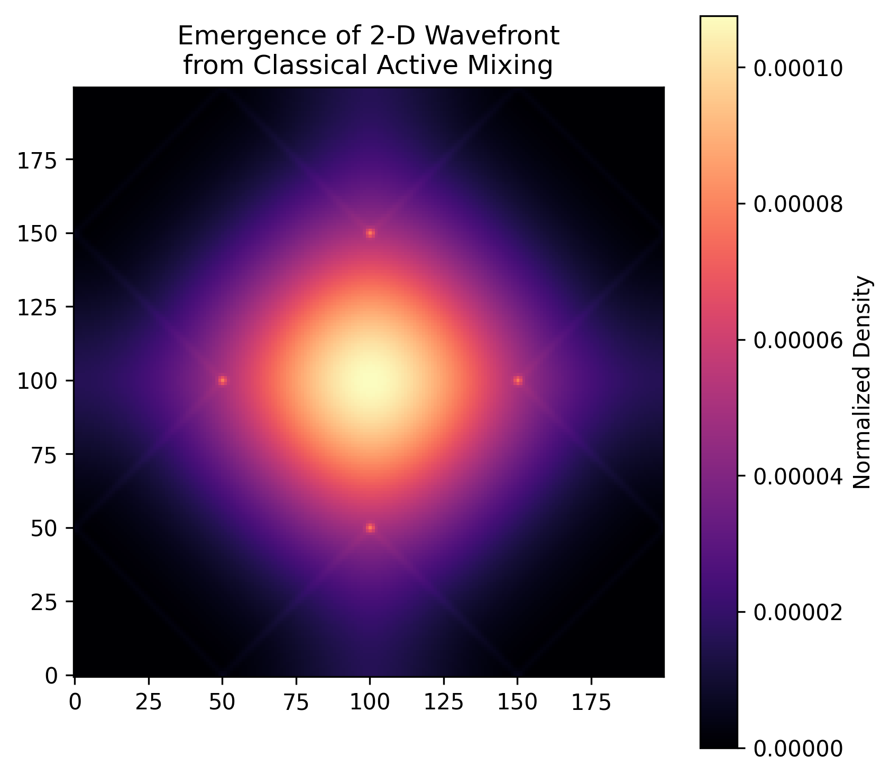
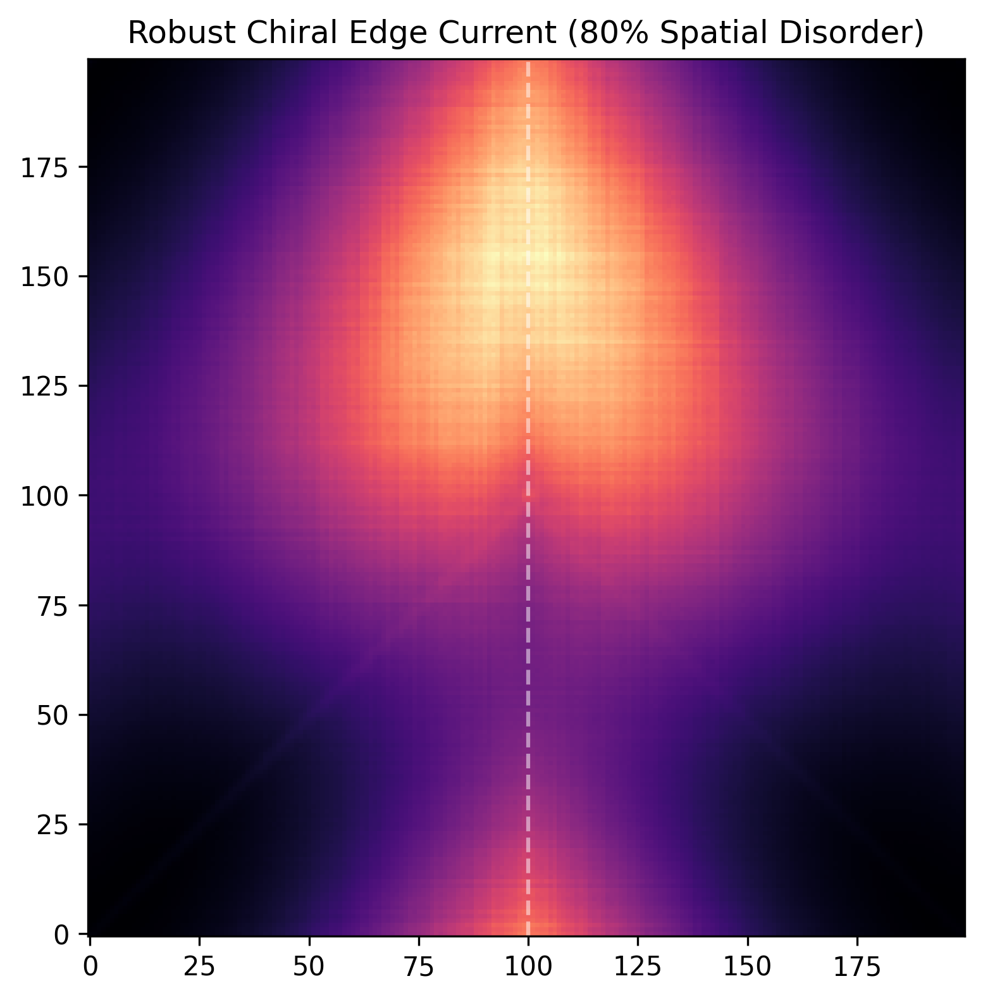
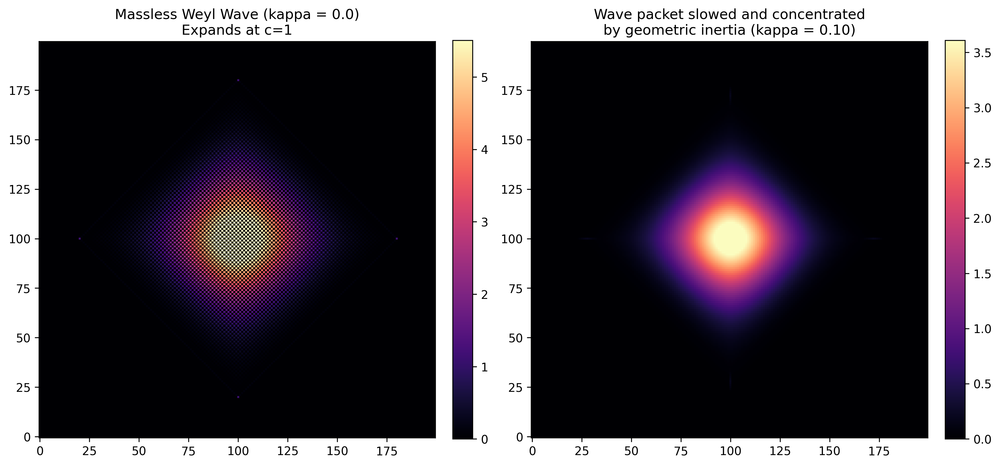

# Cédric Van Caillie

**Explorer of hidden patterns**  
Independent researcher in discrete models & quantum foundations  
Belgian thinker

Email: [cedric.van.caillie@gmail.com](mailto:cedric.van.caillie@gmail.com)

---

# The Angular Tetravalent Lattice

**A minimal geometric foundation for active matter, non-unitary quantum walks, emergent continuum physics, the geometric origin of mass, and experimental realisations.**

## Overview

Can the core structures of modern physics — from the emergence of spacetime and the Schrödinger equation to relativistic wave dynamics and the origin of mass — be generated by a single, parameter-free geometric rule?

This repository contains the foundational papers and Python simulators for the **Angular Tetravalent Lattice**. In this framework, physical reality is generated by a four-component state evolving under strict **+90° cyclic permutations**.

The research develops four complementary perspectives:

| Perspective | Core Idea |
|-------------|-----------|
| **Zooming Out** | From the discrete angular lattice → continuum limit → candidate pathway to the Schrödinger & Dirac equations |
| **Zooming In** | From a non-unitary quantum walk → full dephasing → exact recovery of the classical lattice + Weyl dynamics + chiral edge modes |
| **Geometric Origin of Mass** | Discrete elastic restoring force (geometric inertia) → mass-like term while preserving the light-cone → conceptual motivation for **E = mc²** |
| **Experimental Realisation** | Concrete hardware blueprints for acoustic and photonic platforms |

---

## The Research

### 1. Zooming Out — Generative Foundation

**A Discrete Angular Tetravalent Lattice and a Candidate Pathway to the Schrödinger Equation**

- **Zenodo:** [10.5281/zenodo.21460531](https://zenodo.org/records/21460531)
- **PDF:** [ATLC-paper.pdf](./ATLC-paper.pdf)
- **Simulator:** [ATLC_Simulator_v1.4.py](./ATLC_Simulator_v1.4.py)

This paper starts at the microscopic floor: the classical angular lattice. Taking the continuum limit of the discrete 90° rotational grid generates continuum quantum-like equations, providing a candidate geometric pathway to the Schrödinger and Dirac equations.

**Long-term state evolution of the four-component system:**

  

**Elastic rupture risk remains stable, while the Fermat spiral phase grows as expected:**

  

### 2. Zooming In — Quantum-to-Classical Bridge

**The Angular Tetravalent Lattice: A Classical Geometric Model with a Non-Unitary Quantum-Walk Extension and Chiral Edge Modes**

- **Zenodo:** [10.5281/zenodo.21829396](https://zenodo.org/records/21829396)
- **PDF:** [Angular_Tetravalent_Lattice_Classical_Geometric_Model.pdf](./Angular_Tetravalent_Lattice_Classical_Geometric_Model.pdf)
- **Simulator:** [Angular_Tetravalent_Lattice_Code.py](./Angular_Tetravalent_Lattice_Code.py)

Starting from a fully coherent non-unitary quantum walk, full quantum dephasing exactly recovers the classical tetravalent process.

**Key results:**
- Algebraic skeleton of the 2D Weyl operator
- Wave-speed duality (information edge at `c = 1`, macroscopic ridge at `c = 1/2`)
- Robust chiral edge currents that survive strong spatial disorder

**Emergence of a clean 2-D wavefront from classical active mixing:**

  

**Robust chiral edge current that remains unidirectional even under 80% spatial disorder:**

  

### 3. Geometric Origin of Mass

**The Angular Tetravalent Lattice: A Geometric Proposal for the Emergence of Mass and E = mc²**

- **Zenodo:** [10.5281/zenodo.21933730](https://zenodo.org/records/21933730)
- **PDF:** [Angular_Tetravalent_Lattice_Emergence_of_Mass_and_Emc2.pdf](./Angular_Tetravalent_Lattice_Emergence_of_Mass_and_Emc2.pdf)
- **Simulator:** [emergence_of_mass.py](./emergence_of_mass.py)

By introducing a discrete elastic restoring force (geometric inertia), a mass-like term emerges while the absolute light-cone remains strictly preserved. A geometric ansatz is proposed in which rest energy arises as the cross-product of orthogonal lattice velocities, offering a conceptual motivation for **E = mc²**.

**Left:** Massless Weyl wave expanding at c = 1.  
**Right:** The same wave packet slowed and concentrated by geometric inertia.

  

### 4. Translating Theory to Hardware — Experimental Blueprint

**Proposed Experimental Realizations of the Angular Tetravalent Lattice: Simulating Weyl Dynamics and Topological Edge Modes**

- **Zenodo:** [10.5281/zenodo.22056938](https://zenodo.org/records/22056938)
- **PDF:** [VanCaillie_Experimental_Realizations_ATLC_2026.pdf](./VanCaillie_Experimental_Realizations_ATLC_2026.pdf)

This paper translates the abstract mathematical mechanics of the ATLC into concrete physical blueprints for classical wave systems. It provides a direct mapping from the discrete non-unitary update rules to hardware parameters in acoustic waveguide networks and active photonic lattices.

**Key proposals:**
- A bulk lattice for simulating massless Weyl-like dynamics
- A topological domain wall supporting robust unidirectional edge currents (the main experimental proposal)
- An advanced extension demonstrating kinematic mass-like dispersion via geometric inertia

The work explicitly addresses the requirement for non-reciprocal nodes and discusses platform-specific implementation challenges in acoustics and photonics.

---

## Summary of the Programme

These four papers form a coherent research programme:

1. **Zooming out** from the classical lattice generates continuum quantum-like physics.
2. **Zooming in** from a non-unitary quantum walk recovers the same classical lattice while producing Weyl dynamics and robust edge modes.
3. Adding a minimal geometric resistance on the same lattice generates a mass-like term and a candidate geometric interpretation of **E = mc²**.
4. **Translating to hardware** — concrete experimental blueprints for acoustic and photonic platforms.

Together, they suggest that continuum quantum dynamics, chiral edge modes, the emergence of mass, and practical wave-routing devices can arise as consequences of discrete cyclic geometry.

---

## Citation

If you use this work, please cite the corresponding Zenodo records:

**Paper 1**  
Van Caillie, C. (2026). *A Discrete Angular Tetravalent Lattice and a Candidate Pathway to the Schrödinger Equation*. Zenodo.  
https://doi.org/10.5281/zenodo.21460531

**Paper 2**  
Van Caillie, C. (2026). *The Angular Tetravalent Lattice: A Classical Geometric Model with a Non-Unitary Quantum-Walk Extension and Chiral Edge Modes*. Zenodo.  
https://doi.org/10.5281/zenodo.21829396

**Paper 3**  
Van Caillie, C. (2026). *The Angular Tetravalent Lattice: A Geometric Proposal for the Emergence of Mass and E = mc²*. Zenodo.  
https://doi.org/10.5281/zenodo.21933730

**Paper 4**  
Van Caillie, C. (2026). *Proposed Experimental Realizations of the Angular Tetravalent Lattice: Simulating Weyl Dynamics and Topological Edge Modes*. Zenodo.  
https://doi.org/10.5281/zenodo.22056938
